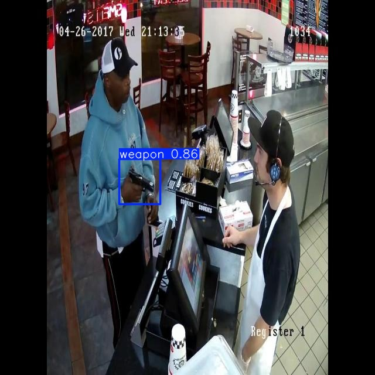

# Realtime Weapon Detection

Realtime Weapon Detection is a project designed to detect weapons in real time using advanced computer vision techniques. It includes a custom-trained detection model, a script for real-time identification, and a user-friendly web app for managing and reviewing detection videos. The system uses YOLOv8 to detect weapons in live camera feeds. The data used to train the model was sourced from multiple datasets on Roboflow, and the model weights can be found in the "Model Training" folder.

- **Model Training:** Develop a robust weapon detection model using the training script provided.
- **Real-Time Detection:** Instantly identify weapons in live feeds with the detection script.
- **Web App Integration:** Store and review detection videos with an intuitive web interface.

